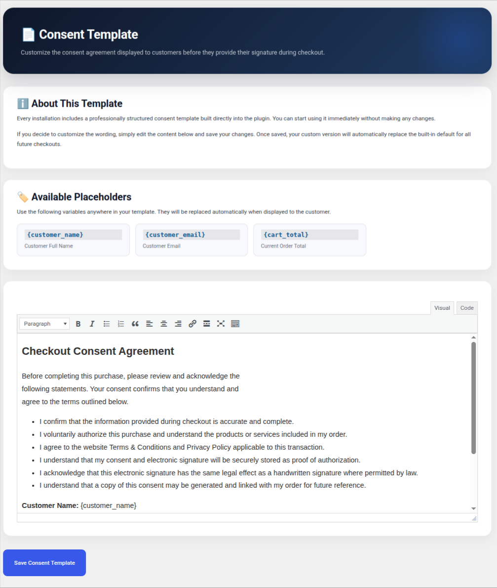

<div align="center">


# Checkout Consent for WooCommerce

**The easiest way to add a digital consent form & signature to WooCommerce checkout.**  
*Require customers to review and sign a consent agreement before every order — and generate a signed PDF record automatically.*

<p>
  
  
  
  
  
  
  
</p>

**[WordPress.org Plugin Page](https://wordpress.org/plugins/woocommerce-checkout-consent/)** &nbsp;·&nbsp; **[Report a Bug](https://github.com/parthodhvani/woocommerce-checkout-consent/issues)** &nbsp;·&nbsp; **[Request a Feature](https://github.com/parthodhvani/woocommerce-checkout-consent/issues)**

</div>

---

## What Is Checkout Consent for WooCommerce?

**Checkout Consent for WooCommerce** is a free WordPress plugin that adds a **digital consent form and signature pad** directly to your WooCommerce checkout page. Before a customer can place an order, they must review your customizable consent agreement and sign it — using their mouse or finger. A **signed PDF is generated automatically** and stored on your server, giving you a permanent legal record for every transaction.

Whether you need a **WooCommerce consent form**, a **WooCommerce digital signature** step, a **WooCommerce GDPR consent** checkbox with proof, or a **signed agreement at checkout**, this plugin handles it — with zero external services, no SaaS fees, and no data leaving your server.

---

## 📸 Screenshots

<table>
  <tr>
    <td align="center" width="50%">
      
      <br/><br/>
      <sub><b>📊 Admin Dashboard</b> — See all customers, orders, signatures, and consent activity at a glance.</sub>
    </td>
    <td align="center" width="50%">
      
      <br/><br/>
      <sub><b>✍️ Signature Pad</b> — Customers sign with their mouse or finger before completing checkout.</sub>
    </td>
  </tr>
  <tr>
    <td align="center" width="50%">
      
      <br/><br/>
      <sub><b>📝 Consent Template</b> — Fully customizable agreement with dynamic placeholders.</sub>
    </td>
    <td align="center" width="50%">
      
      <br/><br/>
      <sub><b>📄 PDF Download</b> — Customers can download their signed consent from the order page or My Account.</sub>
    </td>
  </tr>
</table>

---

## ✨ Features

| | Feature | Description |
|---|---|---|
| 🖊️ | **Digital Signature Pad at Checkout** | Smooth mouse & touch drawing powered by the bundled Signature Pad library. Works on desktop and mobile. |
| 📄 | **Automatic Signed PDF Generation** | Signed consent forms are converted to PDF with the customer's signature image embedded — no external library or service required. |
| ✏️ | **Customizable WooCommerce Consent Template** | Use `{customer_name}`, `{customer_email}`, and `{cart_total}` placeholders to personalize every agreement. |
| 📥 | **Download from Order Page & My Account** | Customers can retrieve their signed PDF from the order-received page or their WooCommerce account. |
| 📊 | **Admin Consent Dashboard** | A dedicated "Customer Affairs" screen shows total orders, signed consents, and per-customer history. |
| 📤 | **CSV / JSON Export & Import** | Bulk-export consent records for compliance reporting or migrate data from another system. |
| 🔍 | **Full Audit Log** | Every action — consent signed, PDF generated, PDF downloaded — is timestamped and logged. |
| ⚡ | **HPOS Compatible** | Fully declared compatible with WooCommerce High-Performance Order Storage. |
| 🔒 | **Zero External Services** | All signatures, PDFs, and audit logs stay entirely on your server. No SaaS. No subscription. No phone-home. |

---

## 🚀 Installation

### From WordPress Admin (Recommended)
1. Go to **Plugins → Add New** and search for **Checkout Consent for WooCommerce**
2. Click **Install Now**, then **Activate**
3. Ensure WooCommerce is installed and active

### Manual Upload
1. Download the `.zip` and upload the `woocommerce-checkout-consent` folder to `/wp-content/plugins/`
2. Activate through **Plugins → Installed Plugins**

### After Activation
```
Checkout Consent → Settings          ← configure consent behaviour & options
Checkout Consent → Consent Template  ← write and format your consent agreement
```

> **⚠️ Important:** The WooCommerce consent step requires the **classic checkout shortcode** `[woocommerce_checkout]` on your Checkout page. Block-based checkout support is planned for a future release.

---

## 🖊️ Consent Template Placeholders

Personalize your WooCommerce consent form dynamically at checkout:

| Placeholder | Replaced With |
|---|---|
| `{customer_name}` | The customer's full name |
| `{customer_email}` | The customer's email address |
| `{cart_total}` | The formatted cart total at checkout |

---

## 🗂️ Where Are the Signed PDFs Stored?

Signed consent PDFs are written to:
```
wp-content/uploads/wcca-consents/
```
Filenames are unguessable (UUID-based). Downloads are additionally protected by a **nonce and a capability check**, so files cannot be hot-linked or accessed without authorization.

---

## ❓ Frequently Asked Questions

<details>
<summary><strong>Does this WooCommerce consent plugin work with the block-based checkout?</strong></summary>
<br/>
The consent and signature step hooks into the classic WooCommerce checkout. Set your Checkout page to use the <code>[woocommerce_checkout]</code> shortcode. Block-based checkout support is planned for a future release.
</details>

<details>
<summary><strong>Is a customer's consent reused across multiple orders?</strong></summary>
<br/>
By default, once a customer signs within a browser session they are not asked again until checkout completes. Enable <strong>Settings → Ask for Consent Every Time</strong> to force a fresh consent signature on every checkout.
</details>

<details>
<summary><strong>Does the plugin send data to any external service?</strong></summary>
<br/>
No. All data — signatures, PDFs, audit logs — is stored exclusively on your own WordPress installation. There are no external API calls and no subscription required.
</details>

<details>
<summary><strong>Is this plugin GDPR-friendly?</strong></summary>
<br/>
The plugin records when, what, and by whom consent was given, giving you a documented audit trail. You are responsible for the content of your consent agreement; consult your legal adviser for compliance advice specific to your jurisdiction.
</details>

<details>
<summary><strong>Can I export WooCommerce consent records for compliance?</strong></summary>
<br/>
Yes. The admin dashboard includes one-click CSV and JSON export of all consent records. You can also import from CSV to migrate records from another system.
</details>

<details>
<summary><strong>Where are signed consent PDFs stored?</strong></summary>
<br/>
PDFs are saved to <code>wp-content/uploads/wcca-consents/</code> with UUID-based filenames. Downloads are protected by a nonce and a capability check to prevent unauthorized access.
</details>

---

## 🔍 Who Is This Plugin For?

This plugin is built for any WooCommerce store that needs customers to formally agree to terms before purchasing:

- **Service businesses** requiring a signed service agreement before booking
- **Health & wellness stores** needing an informed consent or liability waiver
- **B2B stores** collecting signed terms & conditions at checkout
- **Subscription businesses** capturing explicit consent for recurring billing
- **Any store** wanting a GDPR-compliant, auditable consent record with proof of signature

---

## 📋 Changelog

### 1.2.0
- ✅ **Fixed** — PDF generation now produces a complete, valid signed-consent document (previously an empty placeholder was written)
- ✅ **Fixed** — Customer signature image is now correctly embedded in the generated PDF
- ✅ **Fixed** — Removed deprecated `utf8_decode()` call for PHP 8.2+ compatibility
- ✅ **Fixed** — Corrected malformed markup and an escaped nonce field on the My Account consent form
- 🔄 **Changed** — Unified the text domain to `woocommerce-checkout-consent`
- 🔄 **Changed** — Removed remote Google Fonts requests; UI now uses bundled/system fonts
- ⭐ **Added** — WooCommerce HPOS compatibility declaration
- ⭐ **Added** — `readme.txt` and `uninstall.php` for WordPress.org compliance

### 1.0.0
- 🎉 Initial release

---

## 🛡️ Requirements

| Requirement | Minimum |
|---|---|
| WordPress | 6.0+ |
| WooCommerce | Latest stable |
| PHP | 8.0+ |
| Checkout type | Classic shortcode `[woocommerce_checkout]` |

---

## 👨‍💻 About the Author

<table>
  <tr>
    <td width="72" align="center">
      <br/>
    </td>
    <td>
      <strong>Parth Odhvani</strong><br/>
      WordPress & PHP Backend Developer · 2 years experience<br/>
      Building practical WooCommerce tools that solve real store problems.<br/><br/>
      <a href="https://github.com/parth0180"></a>
      &nbsp;
      <a href="https://profiles.wordpress.org/parthodhvani018/"></a>
    </td>
  </tr>
</table>

---

## 📜 License

Released under the [GNU General Public License v2.0](https://www.gnu.org/licenses/gpl-2.0.html) or later.

---

<div align="center">

Made with ❤️ for WooCommerce stores that take compliance seriously.

**[WordPress.org Plugin Page](https://wordpress.org/plugins/woocommerce-checkout-consent/)** &nbsp;·&nbsp; **[Report a Bug](https://github.com/parthodhvani/woocommerce-checkout-consent/issues)** &nbsp;·&nbsp; **[Request a Feature](https://github.com/parthodhvani/woocommerce-checkout-consent/issues)**

</div>
