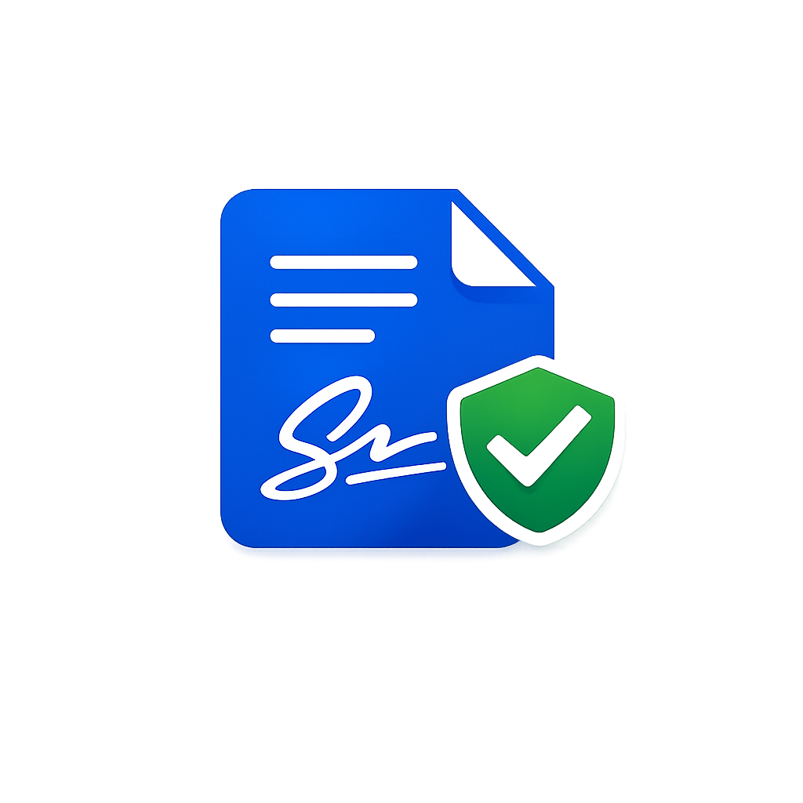
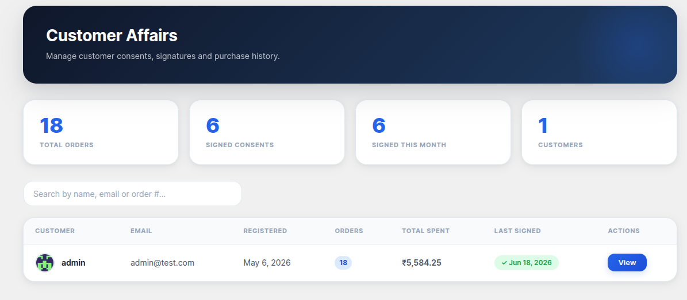
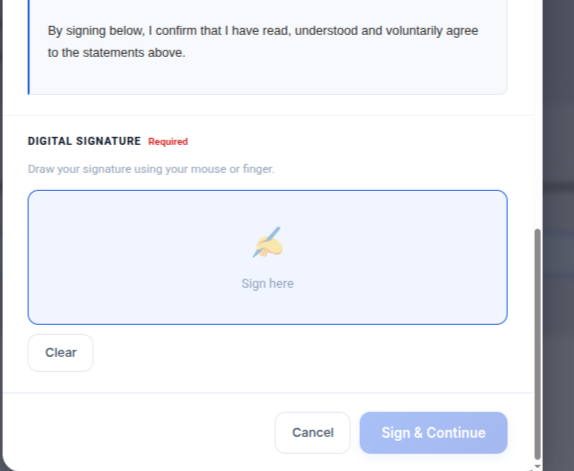
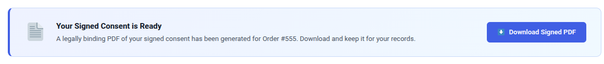

<div align="center">


<br/><br/>



<h1>✍️ Checkout Consent for WooCommerce</h1>

<p align="center">
  <strong>A seamless digital consent & signature step, right inside your WooCommerce checkout.<br/>Every order. Every customer. Every time — with a PDF to prove it.</strong>
</p>

<br/>

[](https://wordpress.org/plugins/woocommerce-checkout-consent/)
[](https://wordpress.org)
[](https://woocommerce.com)
[](https://php.net)
[](https://woocommerce.com/document/high-performance-order-storage/)
[](https://wordpress.org/plugins/woocommerce-checkout-consent/)

</div>

---

## 🎯 What It Does

Before a customer can place an order, they review your customizable consent agreement and sign it — using their **mouse or finger**. The signed consent is recorded against the order and a **PDF is generated automatically**, giving you a permanent, downloadable legal record for every transaction.

No third-party services. No data leaving your server. Just a clean, professional consent flow that protects you and your customers.

---

## 📸 Screenshots

<table>
  <tr>
    <td align="center" width="50%">
      
      <br/>
      <sub><b>📊 Admin Dashboard</b> — See all customers, orders, signatures, and consent activity at a glance.</sub>
    </td>
    <td align="center" width="50%">
      
      <br/>
      <sub><b>✍️ Signature Pad</b> — Customers sign with their mouse or finger before completing checkout.</sub>
    </td>
  </tr>
  <tr>
    <td align="center" width="50%">
      
      <br/>
      <sub><b>📝 Consent Template</b> — Fully customizable agreement with dynamic placeholders.</sub>
    </td>
    <td align="center" width="50%">
      
      <br/>
      <sub><b>📄 PDF Download</b> — Customers can download their signed consent from the order page or My Account.</sub>
    </td>
  </tr>
</table>

---

## ✨ Features

<table>
  <tr>
    <td>🖊️</td>
    <td><strong>Touch & Mouse Signature Pad</strong> — Smooth drawing powered by the bundled Signature Pad library. Works on desktop and mobile.</td>
  </tr>
  <tr>
    <td>📄</td>
    <td><strong>Automatic PDF Generation</strong> — Signed consents are converted to PDF with the customer's signature image embedded — no external library required.</td>
  </tr>
  <tr>
    <td>✏️</td>
    <td><strong>Customizable Consent Template</strong> — Use <code>{customer_name}</code>, <code>{customer_email}</code>, and <code>{cart_total}</code> placeholders to personalize every agreement.</td>
  </tr>
  <tr>
    <td>📥</td>
    <td><strong>Download From Order & My Account</strong> — Customers can retrieve their signed PDF from the order-received page or from their account.</td>
  </tr>
  <tr>
    <td>📊</td>
    <td><strong>Admin Dashboard</strong> — A dedicated "Customer Affairs" screen shows total orders, signed consents, and per-customer history.</td>
  </tr>
  <tr>
    <td>📤</td>
    <td><strong>CSV / JSON Export & Import</strong> — Bulk-export consent records for compliance reporting or migrate data from another system.</td>
  </tr>
  <tr>
    <td>🔍</td>
    <td><strong>Full Audit Log</strong> — Every action — signed, PDF generated, downloaded — is logged with a timestamp.</td>
  </tr>
  <tr>
    <td>⚡</td>
    <td><strong>HPOS Compatible</strong> — Fully declared compatible with WooCommerce High-Performance Order Storage.</td>
  </tr>
  <tr>
    <td>🔒</td>
    <td><strong>Zero External Services</strong> — Signatures and PDFs stay entirely on your server. No SaaS. No subscription.</td>
  </tr>
</table>

---

## 🚀 Installation

### From WordPress Admin
1. Go to **Plugins → Add New** and search for **Checkout Consent for WooCommerce**
2. Click **Install Now**, then **Activate**
3. Make sure WooCommerce is active

### Manual
1. Download the `.zip` and upload the `woocommerce-checkout-consent` folder to `/wp-content/plugins/`
2. Activate through **Plugins → Installed Plugins**

### Setup
```
Checkout Consent → Settings      ← configure consent behaviour
Checkout Consent → Consent Template ← edit your agreement text
```

> **⚠️ Important:** The consent step requires the **classic WooCommerce checkout shortcode** `[woocommerce_checkout]`. If your Checkout page uses the block-based checkout, switch it back to the classic shortcode.

---

## 🖊️ Consent Template Placeholders

| Placeholder | Replaced With |
|---|---|
| `{customer_name}` | The customer's full name |
| `{customer_email}` | The customer's email address |
| `{cart_total}` | The formatted cart total at checkout |

---

## 🗂️ Where Are the PDFs Stored?

Signed PDFs are written to:
```
wp-content/uploads/wcca-consents/
```
Filenames are unguessable (UUID-based). Downloads are additionally protected by a **nonce and a capability check**, so files cannot be hot-linked.

---

## ❓ FAQ

<details>
<summary><strong>Does this work with the block-based checkout?</strong></summary>
<br/>
The consent step hooks into the classic WooCommerce checkout. Set your Checkout page to use the <code>[woocommerce_checkout]</code> shortcode. Block-based checkout support is planned for a future release.
</details>

<details>
<summary><strong>Is a customer's consent reused across orders?</strong></summary>
<br/>
By default, once a customer signs within a browser session they are not asked again until checkout completes. Enable <strong>Settings → Ask for Consent Every Time</strong> to force the prompt on every checkout.
</details>

<details>
<summary><strong>Does the plugin connect to any external service?</strong></summary>
<br/>
No. All data — signatures, PDFs, audit logs — is stored exclusively on your own WordPress installation. There are no external API calls and no subscription required.
</details>

<details>
<summary><strong>Is this GDPR-friendly?</strong></summary>
<br/>
The plugin records when, what, and by whom consent was given, giving you a documented audit trail. You are responsible for the content of your consent agreement; consult your legal adviser for compliance advice specific to your jurisdiction.
</details>

<details>
<summary><strong>Can I export consent records?</strong></summary>
<br/>
Yes. The admin dashboard includes CSV and JSON export. You can also import from CSV to migrate records.
</details>

---

## 📋 Changelog

### 1.2.0
- ✅ **Fixed** — PDF generation now produces a complete, valid signed-consent document (previously an empty placeholder was written)
- ✅ **Fixed** — Customer signature image is now correctly embedded in the generated PDF
- ✅ **Fixed** — Removed deprecated `utf8_decode()` call for PHP 8.2+ compatibility
- ✅ **Fixed** — Corrected malformed markup and an escaped nonce field on the My Account consent form
- 🔄 **Changed** — Unified the text domain to `woocommerce-checkout-consent`
- 🔄 **Changed** — Removed remote Google Fonts requests; UI now uses bundled/system fonts
- ⭐ **Added** — WooCommerce HPOS compatibility declaration
- ⭐ **Added** — `readme.txt` and `uninstall.php` for WordPress.org compliance

### 1.0.0
- 🎉 Initial release

---

## 🛡️ Requirements

| Requirement | Minimum |
|---|---|
| WordPress | 6.0+ |
| WooCommerce | Latest stable |
| PHP | 8.0+ |
| Checkout type | Classic shortcode `[woocommerce_checkout]` |

---

## 📜 License

Released under the [GNU General Public License v3.0](https://www.gnu.org/licenses/gpl-2.0.html) or later.

---

<div align="center">

Made with ❤️ for WooCommerce stores that take compliance seriously.

**[WordPress.org Plugin Page](https://wordpress.org/plugins/woocommerce-checkout-consent/)** · **[Report a Bug](https://github.com/parthodhvani/woocommerce-checkout-consent/issues)** · **[Request a Feature](https://github.com/parthodhvani/woocommerce-checkout-consent/issues)**

</div>
